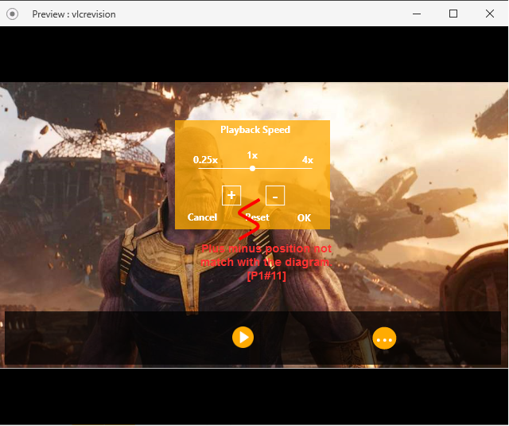
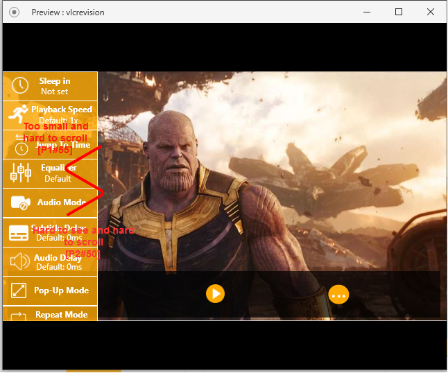
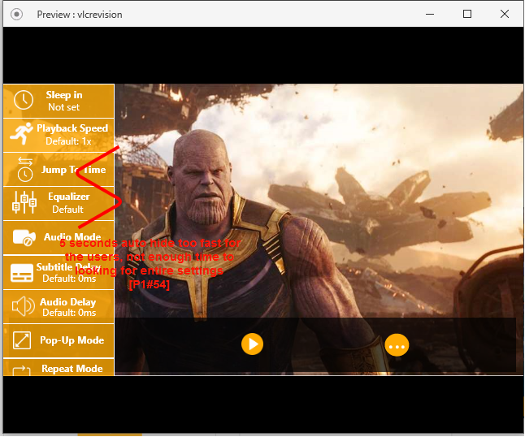
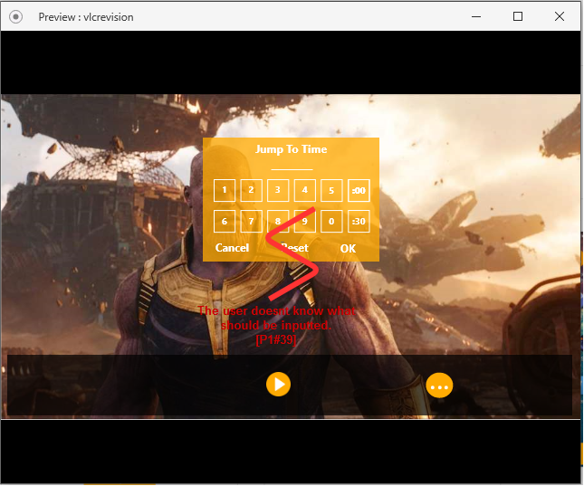
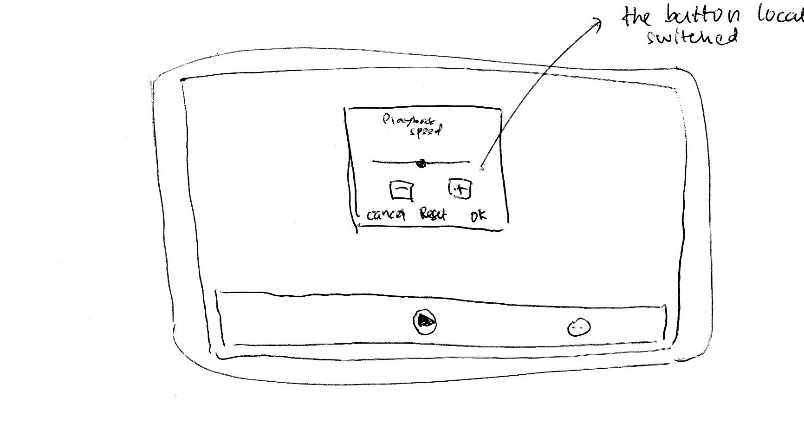
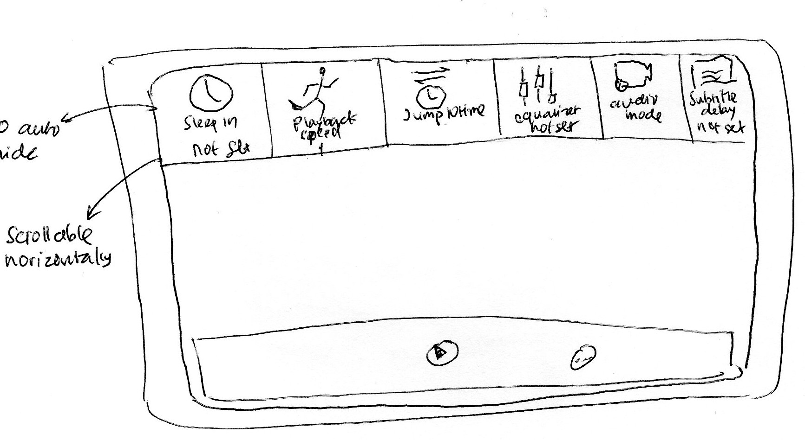
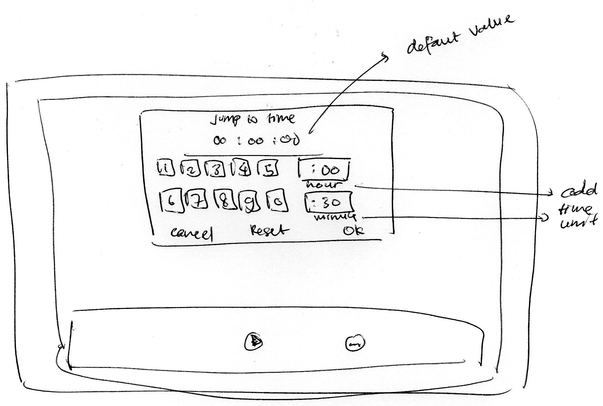

# Table of Contents

- [Usability Evaluation and Prototyping (again)](#usability-evaluation-and-prototyping--again-)
  * [Operating the Prototype](#operating-the-prototype)
  * [Part A: Usability Evaluation](#part-a--usability-evaluation)
    + [1. Brief Description of Participants](#1-brief-description-of-participants)
      - [a. Description of Participant 1](#a-description-of-participant-1)
      - [b. Description of Participant 2](#b-description-of-participant-2)
    + [2. Evaluation Script](#2-evaluation-script)
    + [3. Transcript](#3-transcript)
      - [a. Transcript with Participant 1](#a-transcript-with-participant-1)
      - [b. Transcript with Participant 2](#b-transcript-with-participant-2)
    + [4. Feedback and Incidence Analysis](#4-feedback-and-incidence-analysis)
      - [Observation 1](#observation-1)
      - [Observation 2](#observation-2)
      - [Observation 3](#observation-3)
      - [Observation 4](#observation-4)
      - [Observation 5](#observation-5)
      - [Observation 6](#observation-6)
  * [Part B: Prototyping (again)](#part-b--prototyping--again-)
    + [Sketch](#sketch)
    + [Design Rationale](#design-rationale)
    + [High-Fidelity Interactive-Prototype](#high-fidelity-interactive-prototype)

# Usability Evaluation and Prototyping (again)

## Operating the Prototype
[Video for prototype](https://youtu.be/IW_tQBkwvVs)

---

## Part A: Usability Evaluation

### 1. Brief Description of Participants

#### a. Description of Participant 1
- A Man.
- 20 years old.
- Currently studying Pharmacy at Airlangga University.
- Experienced using smartphone mainly for media social.
- Participant of CI.

#### b. Description of Participant 2
- A Man.
- 20 years old.
- Currently studying Geomatics Engineering at Institut Teknologi Sepuluh Nopember.
- Experienced using smartphone for chatting.

### 2. Evaluation Script
- Try to set the video to run 2 times faster.
- Set the audio delay for 3 mins.
- Set the subtitle delay for 50 ms.
- Play the video in audio mode and back to normal after that.
- Try to jump minute 30 in the video.
- Try to play the video in the pop up mode and back to normal after that.
- Try to settings the video to repeat after it ended.

### 3. Transcript

#### a. Transcript with Participant 1
 1. **Me**: Halo, ketemu lagi. Terima kasih telah meluangkan waktu.
 1. **Participant**: Iya sama-sama.
 1. **Me**: Jadi ini adalah lanjutan dari kegiatan kemarin. Disini anda diminta meninjau kembali prototype hasil buatan saya berdasarkan keluhan-keluhan yang anda berikan pada kegiatan sebelumnya.
 1. **Participant**: Baik.
 1. **Me**: Jadi dimulai saja.
 1. **Me**: Coba settings videonya untuk berputar dua kali lebih cepat.
 1. **Participant**: _Membuka playback speed settings menu_.
 1. **Participant**: _Menekan tombol plus 2 kali_.
 1. **Participant**: Oke udah.
 1. **Me**: Baik. Gimana menurutmu ?
 1. **Participant**: Settingsnya enak yang ini ada logo sama tulisannya jadi lebih jelas, gak kaya kemarin isinya logo aja jadi kaya nebak-nebak gitu. Tapi di bagian playback speed ini posisi tombol plus minusnya menurut saya gak pas karena plus dikanan tapi kalo diklik barnya gerak ke kanan.
 1. **Me**: Okee noted.
 1. **Me**: Lanjut ya, coba settings videonya agar memiliki delay audio 3 menit.
 1. **Participant**: Okee.
 1. **Participant**: _Membuka audio delay settings menu_.
 1. **Participant**: 3 menit udah.
 1. **Me**: Okee, gimana tadi ?
 1. **Participant**: Bagus menunya aku suka. Ada bermacam pilihan mau naik 10, 50, atau 100 bisa ditambah dan dikurang. Jadi gampang.
 1. **Me**: Lanjut lagi, sekarang coba settings delay subtitlenya jadi 50ms.
 1. **Participant**: Okee.
 1. **Participant**: _Membuka subtitle delay settings menu_. 
 1. **Participant**: Udah.
 1. **Me**: Okeey, gimana tadi ?
 1. **Participant**: Sama kaya tadi, mirip kaya audio delay.
 1. **Me**: Okee lanjut lagi, coba putar videonya dalam mode audio dan kembalikan seperti semula.
 1. **Participant**: Okee. _Membuka settings, menekan bagian audio mode_.
 1. **Participant**: _Memasuki mode audio, kemudian menekan tombol kembali_. Sudah kembali seperti semua.
 1. **Me**: Okee, sepertinya gak ada kesulitan ya.
 1. **Participant**: Iya karena di settingsnya udah ada tulisan yang jelas dan habis di klik videonya langsung memasuki mode audio. Di mode audionya juga gampang ada 4 tombol. 1 tombol berlogo video yang mengindikasikan untuk kembali ke awal.
 1. **Me**: Okee jadi lancar ya. Lanjut. Coba bikin videonya menuju menit 30.
 1. **Participant**: Baik.
 1. **Me**: Halo, ketemu lagi. Terima kasih telah meluangkan waktu.
 1. **Participant**: Iya sama-sama.
 1. **Me**: Jadi ini adalah lanjutan dari kegiatan kemarin. Disini anda diminta meninjau kembali prototype hasil buatan saya berdasarkan keluhan-keluhan yang anda berikan pada kegiatan sebelumnya.
 1. **Participant**: Baik.
 1. **Participant**: _Memasuki Jump To Time menu, menekan tombol :30_.
 1. **Participant**: Udah.
 1. **Me**: Okee apakah ada kesusahan ?
 1. **Participant**: Ada sebenernya. Tadi waktu dibuka menu settingsnya kan ada 2 penambahan waktu, nah bingungnya disana tidak tertulis satuannya apa jadinya itu menambah 30 menit atau 30 second.
 1. **Me**: Okee noted. Lanjut ya. Coba settings videonya agar diputar dalam mode pop-up dan kembali ke seperti semula. 
 1. **Participant**: _Memasuki mode pop-up_.
 1. **Participant**: _Menekan video dan memperbesarkembali_.
 1. **Participant**: Okee sudah.
 1. **Me**: Kayanya lancar aja ya wkwk.
 1. **Participant**: Gampang emang wkwk di menu udah ada tulisannya. Terus waktu mau kembali ke awal ada logo seperti membesar gitu.
 1. **Me**: Okee. Terakhir, settings videonya agar setelah selesai akan mutar kembali.
 1. **Participant**: Baik.
 1. **Participant**: _Membuka settings dan menekan bagian Repeat Mode_.
 1. **Participant**: Udah.
 1. **Me**: Okee deh. Gimana ?
 1. **Participant**: Udah bagus cuma kurang penanda aja apakah bener bener udah ke klik atau belum wkwkw soalnya langsung nutup gitu.
 1. **Me**: Itu tandanya ada dibawah settingnya nanti.
 1. **Me**: Apakah ada yang ingin disampaikan ?
 1. **Participant**: Agak terganggu dengan menu settings yang menghilang setelah beberapa detik. Kalo bisa dibikin lebih lama soalnya belum selesai nyari udah ketutup sendiri.
 1. **Participant**: Sama menurutku mending buat diatas untuk settingsnya, kalo disamping agak susah scroll terus kecil juga. Saran aja sih wkwk.
 1. **Me**: Okee terima kasih atas sarannya.
 1. **Participant**: Sama-sama.

#### b. Transcript with Participant 2
 1. **Me**: Halo. Terima kasih telah meluangkan waktu.
 1. **Participant**: Iys.
 1. **Me**: Jadi sebelum mulai, di depan anda ini adalah prototype aplikasi VLC untuk android. Jadi nanti aplikasinya ga bakal jalan seperti aplikasi sesungguhnya dan cuma menampilkan tampilannya saja.
 1. **Participant**: Okee.
 1. **Me**: Jadi nanti aku bakal ngasi beberapa test untuk dilakukan, tapi santai aja ini untuk bahan evaluasi.
 1. **Participant**: Okee.
 1. **Me**: Dimulai aja ya, pertama coba settings videonya menjadi 2 kali lebih cepat.
 1. **Participant**: _Memasuki playback settings menu_.
 1. **Participant**: Ini gak gerak.
 1. **Me**: Iya karena ini prototype jadi hanya berupa tampilan.
 1. **Participant**: Okee udah berarti.
 1. **Me**: Okee. Gimana ?
 1. **Participant**: Gampang sih nyarinya, gak ada kesusahan. Tampilannya bagus.
 1. **Me**: Lanjut ya, coba set delay audionya menjadi 3 menit.
 1. **Participant**: _Masuk ke subtitle settings menu_
 1. **Participant**: _Menyadari salah dan masuk ke audio delay settings_.
 1. **Participant**: Udah.
 1. **Me**: Okee. Tadi kayanya sempet salah wkwk. Itu kenapa ?
 1. **Participant**: Wkwkw iya. Enggak kenapa sih, tergesa-gesa aja aku jadinya salah klik wkwk.
 1. **Me**: Okeedeh. Santai aja ini gak diapa-apain kok wkwk.
 1. **Me**: Lanjut ya. Settings delay subtitle videonya menjadi 50ms.
 1. **Participant**: Udah.
 1. **Me**: Okee bener. Gimana tadi ?
 1. **Participant**: Logonya kurang nyambung sih menurutku tapi untung ada tulisannya.
 1. **Me**: Okee. Lanjut ya. Coba puter videonya menjadi mode audio dan kembali ke normal lagi.
 1. **Participant**: Okee.
 1. **Participant**: _Menekan audio mode pada settings_.
 1. **Participant**: _Memasuki mode audio dan menekan tombol kembali_.
 1. **Participant**: Udah.
 1. **Me**: Gimana apakah ada kesusahan ?
 1. **Participant**: Gampang sih, jelas tombolnya.
 1. **Me**: Okeey lanjut lagi. Coba lompat menuju menit 30 dalam video.
 1. **Participant**: Okee.
 1. **Participant**: _Memasuki menu jump to time_.
 1. **Participant**: Udah.
 1. **Me**: Lancar aja ya sepertinya.
 1. **Participant**: Iya gak ada kesusahan.
 1. **Me**: Okee lanjut ya. Coba puter videonya dalam pop up mode dan kembali ke awal.
 1. **Participant**: Okee.
 1. **Participant**: _Menekan pop-up mode pada menu settings_.
 1. **Participant**: _Memasuki mode pop-up dan menekan berhasil kembali_.
 1. **Me**: Gimana lancar aja sepertinya ?
 1. **Participant**: Iya gampang udah jelas terlihat di settingnya.
 1. **Me**: Okee. Terakhir coba settings videonya supaya kembali muter setelah selesai.
 1. **Participant**: Okee.
 1. **Participant**: _Menekan repeat-mode settings_.
 1. **Participant**: Gitu ya ?.
 1. **Me**: Iyaa udah bener. Sudah selesai.
 1. **Me**: Gimana apakah ada yang ingin disampaikan ?
 1. **Participant**: Kalo tampilannya settingsnya ditaruh diatas gimana ? Soalnya menurutku disamping agak susah scorllnya terus kecil juga.
 1. **Me**: Kalo diatas nanti jadi scroll kesamping gitu ?.
 1. **Participant**: Iyaa lebih enak menurutku diatas trus scrollnya kesamping.
 1. **Me**: Okee terima kasih atas masukkannya.

### 4. Feedback and Incidence Analysis

#### OBSERVATION 1

 - **Reference**:   
    - [P1#11] : Tapi di bagian playback speed ini posisi tombol plus minusnya menurut saya gak pas karena plus dikanan tapi kalo diklik barnya gerak ke kanan."
 - **Feedback**: 
    - [P1] : The plus button is located at left but the bar move to the right when the plus button is pressed.
 - **Incidence**:  
    - [P1#11] : Makes user confuse.
 - **Reason**:  
    - [P1#11] : The position of plus and minus button is flip over.
 - **Resolution**: 
    - Change the location of plus button and minus button. Plus button on the right and minus button on the left.
 
#### OBSERVATION 2

 - **Reference**: 
    - [P1#55] : Sama menurutku mending buat diatas untuk settingsnya, kalo disamping agak susah scroll terus kecil juga. Saran aja sih wkwk.
    - [P2#50] : Kalo tampilannya settingsnya ditaruh diatas gimana ? Soalnya menurutku disamping agak susah scorllnya terus kecil juga.
 - **Feedback**:
    - [P1 & P2] : The settings is rather small and hard to scroll if they are located in the left.
 - **Incidence**: 
    - [P1 & P2] : Participant telling their difficulties throughout the evaluation process.
 - **Reason**: 
    - [P1 & P2] : Because the location of the settings bar makes it hard to scroll and smaller than usual.
 - **Resolution**:
    - Move out the position of the settings bar from left to the top of the screen.
    - Make the settings block bigger.
 
#### OBSERVATION 3

 - **Reference**:
    - [P1#54] : Agak terganggu dengan menu settings yang menghilang setelah beberapa detik. Kalo bisa dibikin lebih lama soalnya belum selesai nyari udah ketutup sendiri.
 - **Feedback**: 
    - [P1] : The auto hide for settings bar too fast for novice user. The user not yet find their settings but the bar begins disappear.
 - **Incidence**: 
    - [P1#54] : Participant telling their difficulties throughout the evaluation process.
 - **Reason**: 
    - [P1] : The auto hide for settings bar too fast for novice user. The user not yet find their settings but the bar begins disappear.
 - **Resolution**:
    - Remove the auto hide timer.

 #### OBSERVATION 4

 - **Reference**: 
    - [P1#11] : Settingsnya enak yang ini ada logo sama tulisannya jadi lebih jelas, gak kaya kemarin isinya logo aja jadi kaya nebak-nebak gitu.
    - [P2#13] : Gampang sih nyarinya, gak ada kesusahan. Tampilannya bagus.
 - **Feedback**: The settings interface is good and easy to use.
 - **Incidence**: None
 - **Reason**: None
 - **Resolution**: None

 #### OBSERVATION 5

 - **Reference**: 
    - [P1#18] : Bagus menunya aku suka. Ada bermacam pilihan mau naik 10, 50, atau 100 bisa ditambah dan dikurang. Jadi gampang.
 - **Feedback**: The audio delay setting menu is very useful. There are multiple increment and decrement value that help users.
 - **Incidence**: None 
 - **Reason**: None
 - **Resolution**: None

 #### OBSERVATION 6

 - **Reference**: 
    - [P1#39] : Ada sebenernya. Tadi waktu dibuka menu settingsnya kan ada 2 penambahan waktu, nah bingungnya disana tidak tertulis satuannya apa jadinya itu menambah 30 menit atau 30 second.
 - **Feedback**: The user missunderstand about the input value of the settings form.
 - **Incidence**:
    - [P1#39] : The user thought that the input value was number of minutes to jump forward rather than the timestamp the user want to go (can be forward or backward with current time). 
 - **Reason**: There is no explanation in the default form value.
 - **Resolution**: 
    - Put 00:00:00 as default value in the form.

 ---

## Part B: Prototyping (again)

### Sketch

   - Resolution for observation 1.
   
   - Resolution for observation 2.
   
   - Resolution for observation 6.
   

### Design Rationale
> Please write a paragraph expressing what you have learned from the usability evaluation, 
> and how it is reflected in your design.

### High-Fidelity Interactive-Prototype
Check out the latest High-Fidelity Interactive-Prototype [in this link](https://xd.adobe.com/view/14acfc97-e553-4f9e-7bd0-aad21a73f600-629d/)
